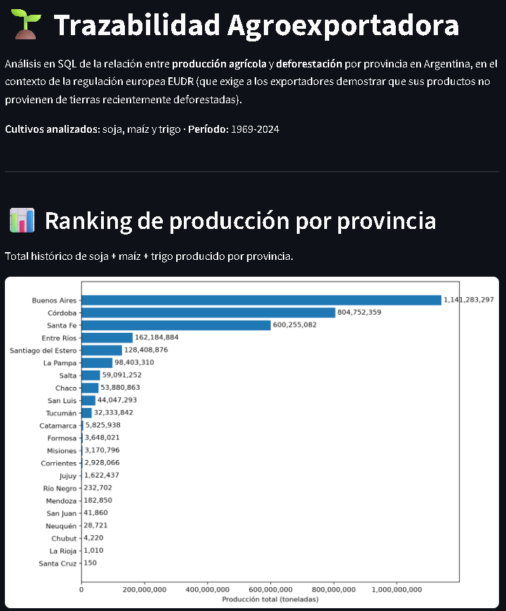
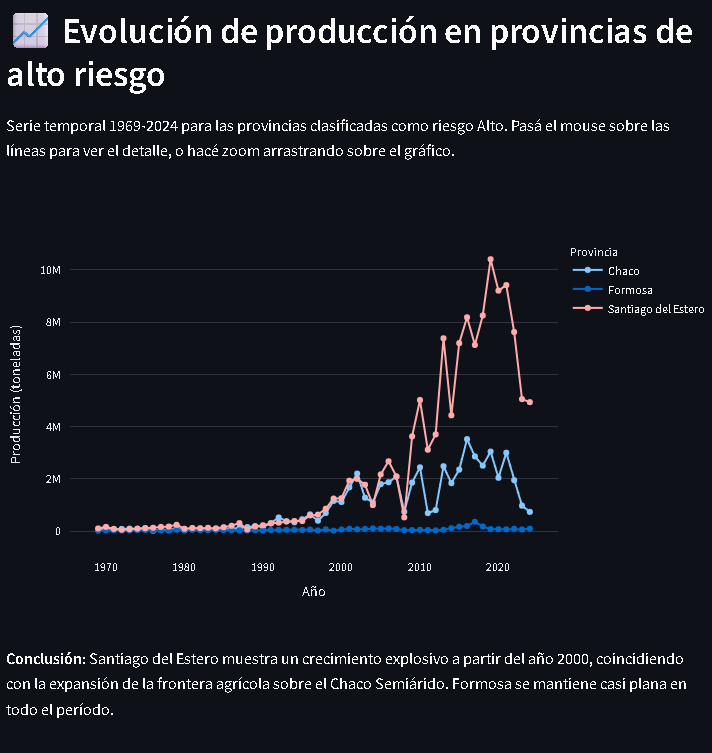

# 🌱 Trazabilidad Agroexportadora

Análisis en SQL de la relación entre producción agrícola y deforestación por provincia en 
Argentina, en el contexto de la regulación europea EUDR.

[👉 Ver dashboard interactivo](https://trazabilidad-agroexportadora-pexwrrd6f48jyrkpqykqip.streamlit.app)



---

## 📌 El problema

Desde 2023, la Unión Europea exige a través de la ley **EUDR** (*EU Deforestation 
Regulation*) que los productos que importa —soja, carne, café, cacao, entre otros— no 
provengan de tierras deforestadas después de diciembre de 2020. Argentina es uno de los 
principales exportadores mundiales de soja, y buena parte de esa producción proviene de 
provincias del norte donde también se concentra la mayor pérdida de bosque nativo.

Este proyecto simula, con datos públicos, el tipo de análisis de riesgo geográfico que hoy 
deben resolver los exportadores argentinos para poder seguir vendiéndole a Europa.

## 🎯 Preguntas que responde el análisis

1. ¿Qué provincias producen más soja, maíz y trigo?
2. ¿Qué provincias perdieron más bosque nativo?
3. ¿Cómo se relacionan producción y deforestación al cruzar ambas variables?
4. ¿Qué provincias clasificarían como "alto riesgo" según ese cruce?
5. ¿El patrón cambia según el cultivo (soja vs. maíz vs. trigo)?
6. ¿Cómo evolucionó la producción a lo largo del tiempo en las provincias de mayor riesgo?

## 📊 Principales hallazgos



- **Buenos Aires, Córdoba y Santa Fe** concentran la mayor parte de la producción, pero son 
  las provincias con **menor** deforestación — el riesgo no está donde está el volumen.
- **Santiago del Estero, Formosa y Chaco** encabezan el ranking de deforestación y quedan 
  clasificadas como "Alto riesgo", pese a tener una producción comparativamente menor.
- El patrón de riesgo se mantiene consistente entre los tres cultivos analizados (soja, 
  maíz, trigo) — no es un fenómeno exclusivo de la soja.
- Santiago del Estero muestra un crecimiento de producción de casi 50x entre 1969 y 2024, 
  coincidiendo con la expansión de la frontera agrícola sobre el Chaco Semiárido.

## 🗂️ Fuentes de datos

| Dataset | Fuente | Nivel de detalle |
|---|---|---|
| Estimaciones agrícolas (producción, superficie, rendimiento) | [MAGyP - Datos Abiertos](https://datos.magyp.gob.ar/dataset/estimaciones-agricolas) | Por departamento y campaña, 1969-2024 |
| Pérdida de bosque nativo por categoría de conservación | [Ministerio de Ambiente - Datos Argentina](https://portal-andino.datos.gob.ar/dataset/estado-bosque-nativo) | Por provincia, acumulado |

## 🛠️ Stack tecnológico

- **Python** (pandas) — limpieza y transformación de datos
- **SQLite** — base de datos relacional
- **SQL** — JOINs, CTEs (`WITH`), `GROUP BY`, `CASE WHEN`
- **Matplotlib** — visualizaciones exploratorias
- **Plotly** — gráfico interactivo (hover, zoom)
- **Streamlit** — dashboard web

## 📁 Estructura del proyecto

```
trazabilidad-agroexportadora/
│
├── data/
│   ├── raw/              # CSVs originales, sin modificar
│   └── processed/        # CSVs limpios, listos para SQL
│
├── notebooks/
│   ├── 01_exploracion.ipynb
│   ├── 02_limpieza.ipynb
│   ├── 03_carga_sql.ipynb
│   ├── 04_analisis_sql.ipynb
│   └── 05_graficos.ipynb
│
├── sql/
│   ├── ranking_produccion.sql
│   ├── ranking_deforestacion.sql
│   ├── produccion_vs_deforestacion.sql
│   ├── clasificacion_riesgo.sql
│   ├── riesgo_por_cultivo.sql
│   └── evolucion_alto_riesgo.sql
│
├── database/
│   └── trazabilidad.db
│
├── app/
│   └── dashboard.py
│
├── README.md
└── requirements.txt
```

## ▶️ Cómo correrlo

1. Cloná el repositorio:
   ```
   git clone <url-del-repo>
   cd trazabilidad-agroexportadora
   ```

2. Instalá las dependencias:
   ```
   pip install -r requirements.txt
   ```

3. (Opcional) Recorré los notebooks en orden, del `01` al `05`, para ver todo el proceso 
   de exploración, limpieza, carga y análisis.

4. Corré el dashboard:
   ```
   cd app
   streamlit run dashboard.py
   ```

## ⚠️ Limitaciones metodológicas

- El cruce entre producción y deforestación se hace **por provincia**, no por lote o 
  departamento — el dataset de deforestación público no ofrece ese nivel de detalle. Es 
  una aproximación geográfica, no una trazabilidad exacta de origen.
- El dataset de deforestación es un dato **acumulado histórico**, sin desagregar por año, 
  a diferencia del de producción que sí es una serie temporal. Por eso el cruce principal 
  compara totales históricos, no evolución año a año.
- No se puede afirmar que una tonelada exportada puntual provenga de un lote deforestado — 
  eso requeriría trazabilidad a nivel de transacción, información privada de las empresas 
  exportadoras.

## 🙋 Sobre el proyecto

Proyecto de portafolio desarrollado como parte de la Tecnicatura en Ciencias de Datos e 
Inteligencia Artificial (UGR), con foco en la práctica de SQL (JOINs, CTEs, agregaciones) 
aplicado a un caso de uso real del sector agroindustrial argentino.